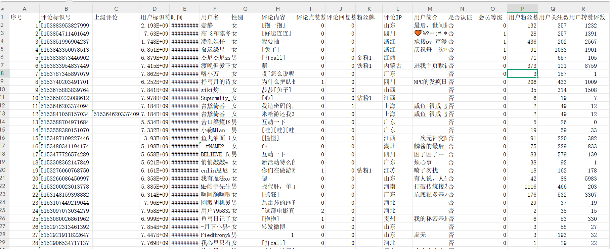
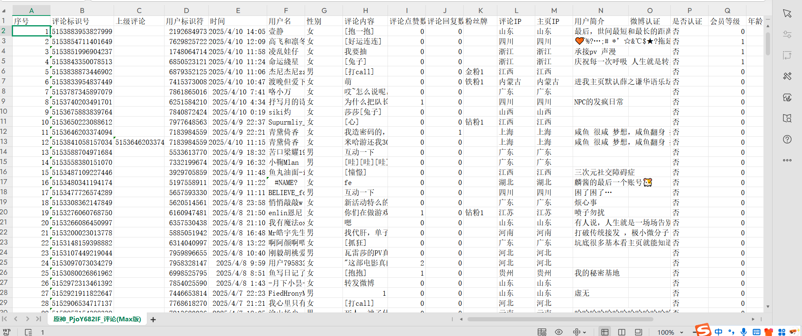
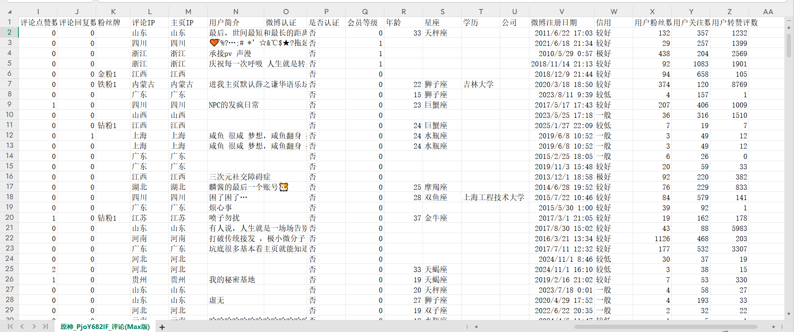
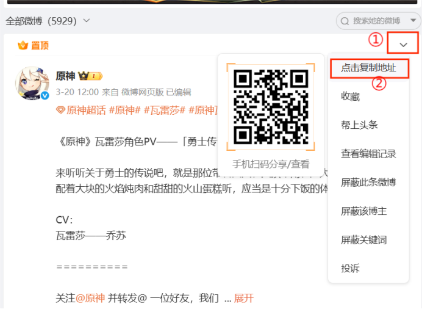
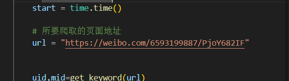
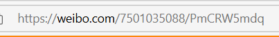
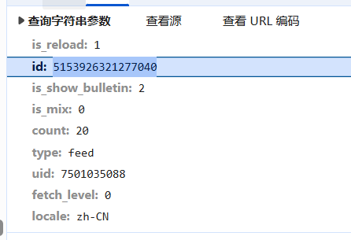

# 1. 项目简介✍🏻

本项目👀是基于**Python**开发的微博评论采集工具，支持深度获取微博评论数据及多维用户画像。通过逆向解析**微博URL**参数，实现短链到博文ID的精准转换，采用递归算法抓取多级嵌套评论（含二级回复）。

系统整合微博开放接口，可提取30+用户属性，涵盖基础信息（性别👩、年龄、星座⛎️）、社交行为（粉丝量、互动量）、认证状态（黄V/企业认证）、信用等级、IP属地及教育职业背景🎓 等维度。

数据以结构化CSV格式存储，包含评论内容、点赞数、用户粉丝等级等字段，适用于舆情分析、用户行为研究等场景。通过Cookie认证机制保障请求合法性，内置0.5秒/次的请求间隔防止反爬，为社交媒体数据挖掘提供高效合规的解决方案。

# 2. 样例展示👊🏻

<font size=6>精简版 **（Min）**</font>

<font size=6>复杂版 **（Max）**</font>



# 3. 使用教程📚️
## 3.1 复制URL
在Web端口找到所要爬取的微博，点击右上角，复制该Web的URL地址。


地址的格式通常是https://weibo.com/用户标识符/微博标识符
如果复制的格式不是这个样子的，请手动修改，然后复制到代码中。


## 3.2 Cookie 和 User-Agent
登录你的网页微博，然后复制你的微博**Cookie**与**User-Agent**，保存到 **weibo_cookie.json**里的对应值中，如果你不知道**Cookie**与**User-Agent**在哪找，请参考[微博cookie怎么找](https://so.csdn.net/so/search?spm=1000.2115.3001.4498&q=%E5%BE%AE%E5%8D%9Acookie%E6%80%8E%E4%B9%88%E6%89%BE&t=&u=&urw=)

## 3.3 复杂版(Max)与精简版(Min)的区别

- **精简版:**
    **优点**：爬取速度很快（一千条评论大概1分40秒），信息能够满足普通的数据分析
    **缺点**：信息量没有复杂版那么多


- **复杂版:**
    **优点**：比精简版能够额外爬取（主页IP、微博认证、年龄、星座、学历、公司、微博注册日期、信用），信息非常全
    **缺点**：由于需要跑额外的数据，涉及到多个数据包的抓取，因此爬取的速度要比精简版慢很多（一千条评论大概20分钟）
    
# 4. 核心教程💖
## 4.1 ID的转化
如图所示，评论的数据包是通过**id**来获取的，也就是可以推测，**id**是每个微博的**唯一标识符**，与**URL**中的**PmCRW5mdq**有异曲同工之处，所以两者之间应该存在某种关联。




随后分析出，**PmCRW5mdq**是经过拆分为多段Base62编码，每段固定补满7位后形成的**5153926321277040**,即**id**。由此便解决了**ID**的转化问题

```python
# 解码
def decode_base62(b62_str):
    charset = "0123456789abcdefghijklmnopqrstuvwxyzABCDEFGHIJKLMNOPQRSTUVWXYZ"
    base = 62
    num = 0
    for c in b62_str:
        num = num * base + charset.index(c)
    return num
def url_to_mid(url):
    result = ''
    for i in range(len(url), 0, -4):
        start = max(i - 4, 0)
        segment = url[start:i]
        num = str(decode_base62(segment))
        if start != 0:
            num = num.zfill(7)  # 除最后一段外都补满7位
        result = num + result
    return int(result)
```
## 4.2 数据包的获取
数据包的获取与项目[bilibili-comment-crawler](https://github.com/1dyer/bilibili-comment-crawler)相似，差不多就是每加载一个**评论数据包**，该**数据包**会存放下一个数据包的地址，类似于通过指针访问数组的形式，可以遍历完所有的**数据包**（二级评论的数据包也如此）。

# 5. 链接解释
## 5.1 评论数据包
<font size=4>返回的是评论信息</font>
https://weibo.com/ajax/statuses/buildComments?flow=1&is_reload=1&id={mid}&is_show_bulletin=2&is_mix=0&max_id={max_id}&count=20&uid={uid}&fetch_level={fetch_level}&locale=zh-CN

**mid**代表该微博（也代表评论）的唯一标识符
**uid**代表该微博（也代表评论）的用户UID
**fetch_level** 代表评论是几级评论（0为一级评论，1为二级评论）

## 5.2 用户信息数据包
<font size=4>返回的用户信息</font>
https://weibo.com/ajax/profile/info?uid={uid}

**uid**代表该微博的用户UID

## 5.3 用户细节信息数据包
<font size=4>返回的用户细节信息</font>
https://weibo.com/ajax/profile/detail?uid={uid}

**uid**代表该微博的用户UID


# 注意事项 ⚠️
- ​**​法律合规​​**
请遵守《中华人民共和国网络安全法》及相关规定

- **账号安全**
建议使用小号Cookie，避免触发微博风控机制

- **频率控制**
默认设置0.5秒/请求间隔（可通过time.sleep调整）或自己使用IP池代理

# 完整代码
## 复杂版（Max）
```python
import requests
import json
from datetime import datetime
import csv
import time

# 统计评论数量
count=0
def add_count():
    global count
    count +=1

# 获取标头
def get_header():
    with open("weibo_cookie.json",'r') as f:
        header=json.loads(f.read())
    return header

# 提取url中的关键词
def get_keyword(url):
    list = url.split('/')
    return list[-2],url_to_mid(list[-1])

# 解码
def decode_base62(b62_str):
    charset = "0123456789abcdefghijklmnopqrstuvwxyzABCDEFGHIJKLMNOPQRSTUVWXYZ"
    base = 62
    num = 0
    for c in b62_str:
        num = num * base + charset.index(c)
    return num
def url_to_mid(url):
    result = ''
    for i in range(len(url), 0, -4):
        start = max(i - 4, 0)
        segment = url[start:i]
        num = str(decode_base62(segment))
        if start != 0:
            num = num.zfill(7)  # 除最后一段外都补满7位
        result = num + result
    return int(result)

# 根据UID返回博主的用户名
def get_name(uid):
    url = f"https://weibo.com/ajax/profile/info?custom={uid}"
    return json.loads(requests.get(url=url,headers=get_header()).content.decode('utf-8'))['data']['user']['screen_name']

# 计算年龄
def get_age(birthday):
    birth = datetime.strptime(birthday, "%Y-%m-%d")
    today = datetime.today()
    return today.year - birth.year - ((today.month, today.day) < (birth.month, birth.day))

# 返回用户数据
def get_user_info(uid):
    # 第一部分信息
    url = f"https://weibo.com/ajax/profile/info?uid={uid}"
    data = json.loads(requests.get(url=url,headers=get_header()).content.decode('utf-8'))['data']['user']
    # 粉丝
    followers_count = data['followers_count']
    # 关注
    friends_count = data['friends_count']
    # 转赞评
    try:
        total_cnt = data['status_total_counter']['total_cnt']
        total_cnt = int(total_cnt.replace(",", ""))
    except:
        total_cnt = ''
    # 简介
    try:
        description = data['description']
    except:
        description = ''
    # 是否认证
    if data['verified'] == True:
        verified = '是'
    else:
        verified = '否'
    # 性别
    try:
        gender = data['gender']
        if gender == 'm':
            gender = '男'
        elif gender == 'f':
            gender = '女'
        else:
            gender = '未知'
    except:
        gender = '未知'
    # 会员等级
    try:
        svip = data['svip']
    except:
        svip = ''
    
    # 第二部分信息
    url = f"https://weibo.com/ajax/profile/detail?uid={uid}"
    data = json.loads(requests.get(url=url,headers=get_header()).content.decode('utf-8'))['data']
    # 年龄
    try:
        age = data['birthday'].split(' ')[0]
        age = get_age(age)
    except:
        age = ''
    # 星座
    try:
        constellation = data['birthday'].split(' ')[1]
    except:
        constellation = ''

    # 微博注册日期
    try:
        weibo_created =  data['created_at']
    except:
        weibo_created = ''
    # 学校
    try:
        school = data['education']['school']
    except:
        school = ''
    # 公司
    try:
        career = data['career']['company']
    except:
        career = ''
    # 微博认证
    try:
        desc_text = data['desc_text']
    except:
        desc_text = ''
    # 主页IP
    try:
        user_location = data['ip_location'][5:]
    except:
        user_location = '其他'
    # 信用
    try:
        sunshine_credit = data['sunshine_credit']['level'][2:]
    except:
        sunshine_credit =''

    
    return followers_count,friends_count,total_cnt,user_location,description,verified,gender,svip,age,constellation,weibo_created,school,career,desc_text,sunshine_credit


# 返回评论数据
def get_data(data):
    # 评论ID
    idstr = data['idstr']
    # 上级评论ID
    rootidstr = data['rootidstr']
    # 发表日期
    created_at = data['created_at']
    dt = datetime.strptime(created_at, "%a %b %d %H:%M:%S %z %Y")
    created_at = dt.strftime("%Y-%m-%d %H:%M:%S")
    # 用户名
    screen_name = data['user']['screen_name']
    # 用户ID
    user_id = data['user']['id']
    # 评论内容
    text_raw = data['text_raw']
    # 评论点赞数
    like = data['like_counts']
    # 评论回复数量
    try:
        total_number = data['total_number']
    except:
        total_number = 0
    # 评论IP
    com_source = data['source'][2:]
    # 粉丝等级
    fan={
        '1':'铁粉',
        '2':'金粉',
        '3':'钻粉'
    }
    try:
        icon_url = data['user']['fansIcon']['icon_url']
        fansIcon = f"{fan[icon_url[-7]]}{icon_url[-5]}"
    except:
        fansIcon = ''
    # 获取用户信息
    followers_count,friends_count,total_cnt,user_location,description,verified,gender,svip,age,constellation,weibo_created,school,career,desc_text,sunshine_credit = get_user_info(user_id)
    

    return idstr,created_at,screen_name,user_id,text_raw,like,com_source,total_number,rootidstr,fansIcon,followers_count,friends_count,total_cnt,user_location,description,verified,gender,svip,age,constellation,weibo_created,school,career,desc_text,sunshine_credit
           

# 获取全部信息
def get_information(uid,mid,max_id,fetch_level):
    if max_id == '':
        url = f"https://weibo.com/ajax/statuses/buildComments?flow=1&is_reload=1&id={mid}&is_show_bulletin=2&is_mix=0&count=20&uid={uid}&fetch_level={fetch_level}&locale=zh-CN"
    else:
        url = f"https://weibo.com/ajax/statuses/buildComments?flow=1&is_reload=1&id={mid}&is_show_bulletin=2&is_mix=0&max_id={max_id}&count=20&uid={uid}&fetch_level={fetch_level}&locale=zh-CN"

    resp = json.loads(requests.get(url=url,headers=get_header()).content.decode('utf-8'))
    datas = resp['data']

    for data in datas:
        add_count()
        idstr,created_at,screen_name,user_id,text_raw,like,com_source,total_number,rootidstr,fansIcon,followers_count,friends_count,total_cnt,user_location,description,verified,gender,svip,age,constellation,weibo_created,school,career,desc_text,sunshine_credit = get_data(data)
        if fetch_level == 0:
            rootidstr = ''
        csv_writer.writerow([count,idstr,rootidstr,user_id,created_at,screen_name,gender,text_raw,like,total_number,fansIcon,com_source,user_location,description,desc_text,verified,svip,age,constellation,school,career,weibo_created,sunshine_credit,followers_count,friends_count,total_cnt])
        time.sleep(0.5)
        # 判断是否存在二级评论
        if total_number >0 and fetch_level == 0:
            get_information(uid,idstr,0,1)
    print(f"当前爬取:{count}条")

    
    # 下一条索引
    max_id = resp['max_id']
    if max_id != 0:    
        get_information(uid,mid,max_id,fetch_level)
    else:
        return
    
    

if __name__ == "__main__":


    # 统计爬虫运行时间
    start = time.time()

    # 所要爬取的页面地址
    url = "https://weibo.com/6593199887/PjoY682IF"


    uid,mid=get_keyword(url)
    print(f"\n创建csv表中...\n创建  {get_name(uid)}_{url.split('/')[-1]}_评论(Max版)  ....")

    # 创建CSV文件并写入表头
    with open(f'./MaxData/{get_name(uid)}_{url.split('/')[-1]}_评论(Max版).csv', mode='w', newline='', encoding='utf-8-sig') as file:
        csv_writer = csv.writer(file)
        csv_writer.writerow(['序号','评论标识号','上级评论','用户标识符','时间','用户名','性别','评论内容','评论点赞数','评论回复数','粉丝牌','评论IP','主页IP','用户简介','微博认证','是否认证','会员等级','年龄','星座','学历','公司','微博注册日期','信用','用户粉丝数','用户关注数','用户转赞评数'])
        get_information(uid,mid,'',0)

    
    print(f"评论爬取完成，共计{count}条，耗时{(time.time()-start)/60:.2f}分")

```
## 精简版（Min）
```python
import requests
import json
from datetime import datetime
import csv
import time

# 统计评论数量
count=0
def add_count():
    global count
    count +=1

# 获取标头
def get_header():
    with open("weibo_cookie.json",'r') as f:
        header=json.loads(f.read())
    return header

# 提取url中的关键词
def get_keyword(url):
    list = url.split('/')
    return list[-2],url_to_mid(list[-1])

# 解码
def decode_base62(b62_str):
    charset = "0123456789abcdefghijklmnopqrstuvwxyzABCDEFGHIJKLMNOPQRSTUVWXYZ"
    base = 62
    num = 0
    for c in b62_str:
        num = num * base + charset.index(c)
    return num
def url_to_mid(url):
    result = ''
    for i in range(len(url), 0, -4):
        start = max(i - 4, 0)
        segment = url[start:i]
        num = str(decode_base62(segment))
        if start != 0:
            num = num.zfill(7)  # 除最后一段外都补满7位
        result = num + result
    return int(result)

# 根据UID返回博主的用户名
def get_name(uid):
    url = f"https://weibo.com/ajax/profile/info?custom={uid}"
    return json.loads(requests.get(url=url,headers=get_header()).content.decode('utf-8'))['data']['user']['screen_name']

# 计算年龄
def get_age(birthday):
    birth = datetime.strptime(birthday, "%Y-%m-%d")
    today = datetime.today()
    return today.year - birth.year - ((today.month, today.day) < (birth.month, birth.day))

# 返回用户数据
def get_user_info(uid):
    # 第一部分信息
    url = f"https://weibo.com/ajax/profile/info?uid={uid}"
    data = json.loads(requests.get(url=url,headers=get_header()).content.decode('utf-8'))['data']['user']
    # 粉丝
    followers_count = data['followers_count']
    # 关注
    friends_count = data['friends_count']
    # 转赞评
    try:
        total_cnt = data['status_total_counter']['total_cnt']
        total_cnt = int(total_cnt.replace(",", ""))
    except:
        total_cnt = ''
    # 简介
    try:
        description = data['description']
    except:
        description = ''
    # 是否认证
    if data['verified'] == True:
        verified = '是'
    else:
        verified = '否'
    # 性别
    try:
        gender = data['gender']
        if gender == 'm':
            gender = '男'
        elif gender == 'f':
            gender = '女'
        else:
            gender = '未知'
    except:
        gender = '未知'
    # 会员等级
    try:
        svip = data['svip']
    except:
        svip = ''
    
    # 第二部分信息
    url = f"https://weibo.com/ajax/profile/detail?uid={uid}"
    data = json.loads(requests.get(url=url,headers=get_header()).content.decode('utf-8'))['data']
    # 年龄
    try:
        age = data['birthday'].split(' ')[0]
        age = get_age(age)
    except:
        age = ''
    # 星座
    try:
        constellation = data['birthday'].split(' ')[1]
    except:
        constellation = ''

    # 微博注册日期
    try:
        weibo_created =  data['created_at']
    except:
        weibo_created = ''
    # 学校
    try:
        school = data['education']['school']
    except:
        school = ''
    # 公司
    try:
        career = data['career']['company']
    except:
        career = ''
    # 微博认证
    try:
        desc_text = data['desc_text']
    except:
        desc_text = ''
    # 主页IP
    try:
        user_location = data['ip_location'][5:]
    except:
        user_location = '其他'
    # 信用
    try:
        sunshine_credit = data['sunshine_credit']['level'][2:]
    except:
        sunshine_credit =''

    
    return followers_count,friends_count,total_cnt,user_location,description,verified,gender,svip,age,constellation,weibo_created,school,career,desc_text,sunshine_credit


# 返回评论数据
def get_data(data):
    # 评论ID
    idstr = data['idstr']
    # 上级评论ID
    rootidstr = data['rootidstr']
    # 发表日期
    created_at = data['created_at']
    dt = datetime.strptime(created_at, "%a %b %d %H:%M:%S %z %Y")
    created_at = dt.strftime("%Y-%m-%d %H:%M:%S")
    # 用户名
    screen_name = data['user']['screen_name']
    # 用户ID
    user_id = data['user']['id']
    # 评论内容
    text_raw = data['text_raw']
    # 评论点赞数
    like = data['like_counts']
    # 评论回复数量
    try:
        total_number = data['total_number']
    except:
        total_number = 0
    # 评论IP
    com_source = data['source'][2:]
    # 粉丝等级
    fan={
        '1':'铁粉',
        '2':'金粉',
        '3':'钻粉'
    }
    try:
        icon_url = data['user']['fansIcon']['icon_url']
        fansIcon = f"{fan[icon_url[-7]]}{icon_url[-5]}"
    except:
        fansIcon = ''
    # 获取用户信息
    followers_count,friends_count,total_cnt,user_location,description,verified,gender,svip,age,constellation,weibo_created,school,career,desc_text,sunshine_credit = get_user_info(user_id)
    

    return idstr,created_at,screen_name,user_id,text_raw,like,com_source,total_number,rootidstr,fansIcon,followers_count,friends_count,total_cnt,user_location,description,verified,gender,svip,age,constellation,weibo_created,school,career,desc_text,sunshine_credit
           

# 获取全部信息
def get_information(uid,mid,max_id,fetch_level):
    if max_id == '':
        url = f"https://weibo.com/ajax/statuses/buildComments?flow=1&is_reload=1&id={mid}&is_show_bulletin=2&is_mix=0&count=20&uid={uid}&fetch_level={fetch_level}&locale=zh-CN"
    else:
        url = f"https://weibo.com/ajax/statuses/buildComments?flow=1&is_reload=1&id={mid}&is_show_bulletin=2&is_mix=0&max_id={max_id}&count=20&uid={uid}&fetch_level={fetch_level}&locale=zh-CN"

    resp = json.loads(requests.get(url=url,headers=get_header()).content.decode('utf-8'))
    datas = resp['data']

    for data in datas:
        add_count()
        idstr,created_at,screen_name,user_id,text_raw,like,com_source,total_number,rootidstr,fansIcon,followers_count,friends_count,total_cnt,user_location,description,verified,gender,svip,age,constellation,weibo_created,school,career,desc_text,sunshine_credit = get_data(data)
        if fetch_level == 0:
            rootidstr = ''
        csv_writer.writerow([count,idstr,rootidstr,user_id,created_at,screen_name,gender,text_raw,like,total_number,fansIcon,com_source,user_location,description,desc_text,verified,svip,age,constellation,school,career,weibo_created,sunshine_credit,followers_count,friends_count,total_cnt])
        time.sleep(0.5)
        # 判断是否存在二级评论
        if total_number >0 and fetch_level == 0:
            get_information(uid,idstr,0,1)
    print(f"当前爬取:{count}条")

    
    # 下一条索引
    max_id = resp['max_id']
    if max_id != 0:    
        get_information(uid,mid,max_id,fetch_level)
    else:
        return
    
    

if __name__ == "__main__":


    # 统计爬虫运行时间
    start = time.time()

    # 所要爬取的页面地址
    url = "https://weibo.com/6593199887/PjoY682IF"


    uid,mid=get_keyword(url)
    print(f"\n创建csv表中...\n创建  {get_name(uid)}_{url.split('/')[-1]}_评论(Max版)  ....")

    # 创建CSV文件并写入表头
    with open(f'./MaxData/{get_name(uid)}_{url.split('/')[-1]}_评论(Max版).csv', mode='w', newline='', encoding='utf-8-sig') as file:
        csv_writer = csv.writer(file)
        csv_writer.writerow(['序号','评论标识号','上级评论','用户标识符','时间','用户名','性别','评论内容','评论点赞数','评论回复数','粉丝牌','评论IP','主页IP','用户简介','微博认证','是否认证','会员等级','年龄','星座','学历','公司','微博注册日期','信用','用户粉丝数','用户关注数','用户转赞评数'])
        get_information(uid,mid,'',0)

    
    print(f"评论爬取完成，共计{count}条，耗时{(time.time()-start)/60:.2f}分")
```
